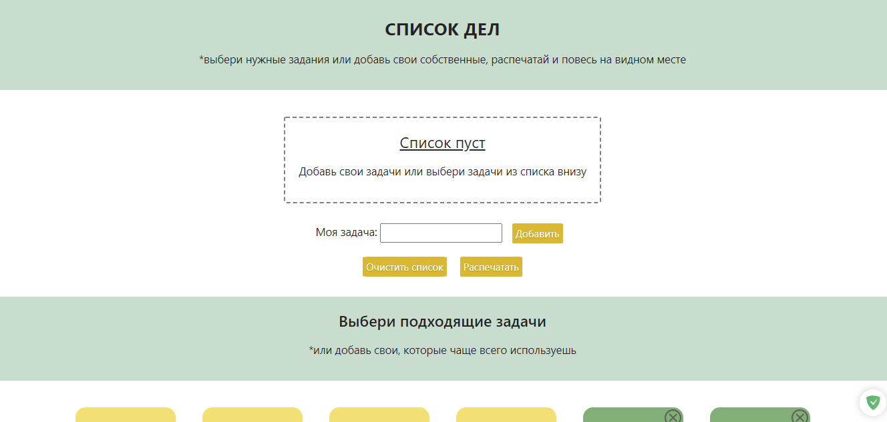
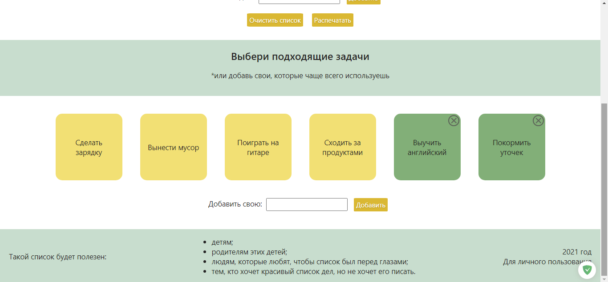
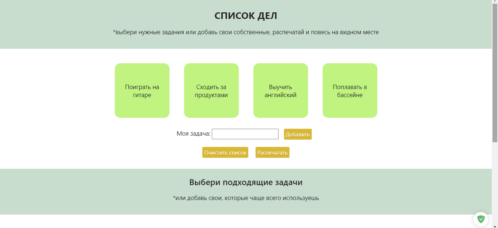
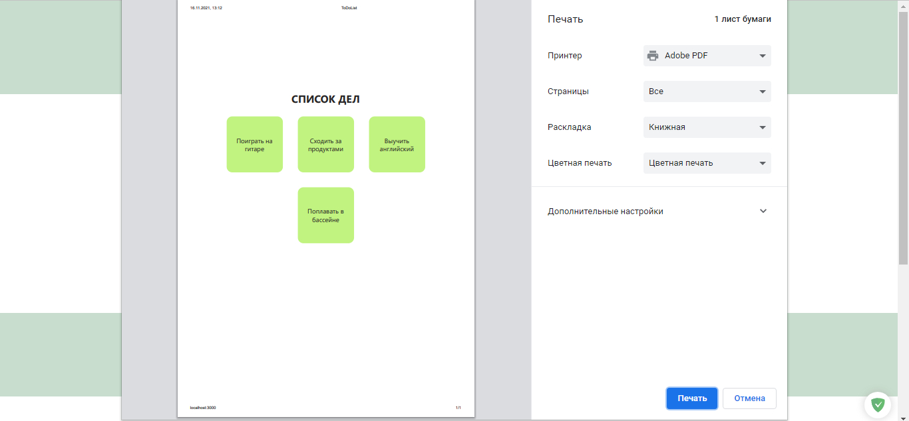

# Учебный проект - Todo-List для печати

Изначально задумывался как список дел для детей, у которых нет смартфонов. Но и взрослым, которые любят всевозможные списки, будет полезен и нагляден.

## Как пользоваться:

Страница условно поделена на 2 части:
- текущий список задач
- задачи по умолчанию

Задачи по умолчанию делятся на 2 вида, отличаются цветом:
- предустановленные
- пользовательские (сохраняются в локальном хранилище)

Когда Вы впервые откроете страницу, пользовательских задач не будет, их можно будет добавить в специальном поле.
Если задача Вам больше не нужна или записана ошибочно, то в углу пользовательских задач есть кнопка удаления.

### Выбираем задачи из готовых и/или добавляем свои собственные (просто кликнуть по нужной задаче).
Ненужные можно удалять по одной или очистить весь список сразу.

### Когда список готов - нажимаем кнопку "Распечатать". Появится окно печати.

Таким образом, можно настраивать приложение под себя и не придется писать длинных списков от руки. 